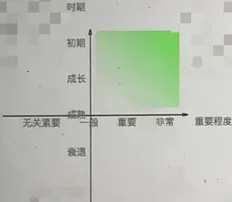

# Taro 项目版本升级规范

## 一、背景

当前团队使用 Taro 开发的项目超过 10+ 个，涉及 H5、小程序，由于缺少统一的升级规范，不同项目间存在 Taro 版本不一致现象，暴露出「低版本项目无法使用高版本特性」、「项目主版本周期性重构工作量和风险大」等问题

## 二、升级考虑维度

1. **业务**：评估业务所处的时期（初期、成长期、成熟期、衰退期）和业务的重要程度（非常重要、重要、一般、无关紧要），越是初期、越是非常重要，升级的必要性和收益越高  
   
2. **功能改进**：评估当前项目是否需频繁新增功能，评估 Taro 的目标新版本是否提供了对当前项目中所需功能的重要改进
3. **安全性**：查看当前项目所使用的 Taro 版本是否存在已知的安全漏洞，并评估新版本是否修复了这些漏洞
4. **维护和支持**：了解当前使用的 Taro 版本是否仍然得到维护和支持。考虑到长期维护的需求，升级到具有长期支持的版本可能更有利于项目的健康发展
5. **性能优化**：评估 Taro 新版本是否提供了性能优化等，例如更快的加载速度、更低的资源占用等
6. **兼容性和迁移成本**：了解 Taro 新版本是否与现有的项目代码和依赖项兼容，并评估进行升级所需的迁移工作量和成本
7. **社区活跃度**：考虑 Taro 新版本是否有一个活跃的开发社区，能够提供及时的支持和解决问题
8. **团队能力和资源**：评估团队的技术能力和资源，判断能否顺利进行版本升级，包括前端、测试团队是否具有足够的技术储备和人力资源

## 二、版本发布规律

-   **结论**：京东在 Taro 3.x 版本稳定运行后，持续以每两周发布一个补丁版本的频率对其进行持续升级。目前不再对 2.x 的次版本进行发布，并且降低了修复 2.x 版本中 Bug 的频率
-   **版本特征**
    -   主版本升级：是对框架的整体架构升级，存在 `Breaking Changes`
    -   次版本升级：是对大特性的支持，部分版本存在 `Breaking Changes`
    -   补丁版本升级：是对前序版本的修复和小特性的新增，其频繁更新的同时存在引入漏洞的风险

| 主版本 | 次版本 | 核心特性 | 发版周期 | 补丁版数 | 典型特性 | 平均补丁发版周期 |
| --- | --- | --- | --- | --- | --- | --- |
| 3.x | 3.6 | 跨端能力提升 | 2023-02-02 ~ 2023-11-24 | 20 | 3.6.20 修复视频组件退出全屏报错问题 | 14.75 天 |
|  | 3.5 | 支持 Pnpm、适配 React18 | 2022-07-27 ~ 2023-01-17 | 12 | 3.5.8 支持图片手势缩放功能 | 14.5 天 |
|  | 3.4 | 支持 PReact 和 Vue3.2 | 2022-01-12 ~ 2023-07-22 | 14 | 3.4.7 支持 PickerView、PickerViewColumn 组件 | 13.5 天 |
|  | 3.3 | 支持 HTML 标签开发 | 2021-07-12 ~ 2022-01-10 | 20 | 3.3.9 修复打包页面后再安卓低端机白屏报错的问题 | 9.1 天 |
|  | 3.2 | 新增 ReactNative 支持 | 2021-04-01 ~ 2021-07-09 | 16 | 3.2.11 支持小程序独立分包 | 6.19 天 |
|  | 3.1 | 支持以插件形式编译到任意平台 | 2021-02-24 ~ 2021-03-31 | 5 | 3.1.1 解决事件冒泡失败的问题 | 7 天 |
|  | 3.0 | 重运行时，轻编译时的新架构 | 2020-07-01 ~ 2021-02-23 | 28 | 3.0.11 修复 TabBar 初始化不显示问题 | 8.46 天 |
| 2.x | 2.2 | 基于 Webpack 构建，各端编译配置统一 | 2020-04-29 ~ 2021-03-19 | 17 | 2.2.14 优化 IOS 输入体验 | 19 天 |

## 三、是否升级

-   To B 项目且业务需求频率低，功能趋于稳定，投入产出比低，「不必须升级」
-   To B 项目且业务需求频率高，根据实际需求进行评估，按照「升级策略进行升级」
-   To C 项目「均必须升级」，减少周期性主版本重构的工作量和风险，持续快速支持业务需求

## 四、升级策略

## 4.1 版本选择

> 版本号说明：x.y.z = 主版本.次版本.补丁版本，如 3.6.10

主要是参考版本发布规律进行升级，最新稳定版以发布 **2 个月** 为维度进行评估

-   **主版本升级**
    -   结论：确认主版本已发布 **超过 6 个月** ，则「必须升级」，并选择该主版本对应发布的最新稳定版
    -   例如：当前项目使用版本 `2.2.13`，官方于 2023-5-1 发布 `3.0.0` 版本，于 2023-11-1 后可选择 2023-9-1 前的最新稳定版，如 `3.0.8`
-   **次版本升级**
    -   原因：主版本更新可能带来其它依赖的兼容适配问题，需要较长时间等待开源社区的更新，同时需确保选择的版本号已经过 **2 个月** 社区检验
    -   结论：若次版本含 `Breaking Changes`，则在该版本发布后的 **4 ~ 6 个月** 期间内「必须升级」；需求依赖高版本特性，选择最新稳定版进行升级
    -   例如：当前项目使用版本 `3.1.10`，官方于 2023-5-1 发布含 `Breaking Changes` 的 `3.2.0` 版本，必须于 2023-9-1 ~ 2023-11-1 间选择完成次版本升级，以 2023-10-1 开始升级工作为例，则选择 2023-8-1 前最近一个稳定版本进行升级
    -   例如：当前项目使用版本 `3.1.10`，官方于 2023-5-1 发布 `3.2.0` 版本，于 2023-9-1 后可选择 2023-7-1 前最近一个稳定版本进行升级
    -   原因：含 `Breaking Changes` 的版本尽早完成升级，可以减少周期性重构的工作量和风险；次版本包含大特性的更新，前 **3** 个补丁版本存在的修复较多（如 `Taro 3.4.2`、`Taro 3.5.2`、`Taro 3.6.3`）， **第 4 个** 版本（**2 个月** 左右）后开始趋于稳定
-   **补丁版本升级**
    -   结论：「不必须升级」，若升级选择最新稳定版
    -   例如：当前项目使用版本 `3.1.10`，官方于 2023-5-1 发布 `3.1.14` 版本，于 2023-7-1 后选择 `3.3.14` 版本进行升级
    -   原因：Taro 补丁版本的发布，既存在对前序版本问题的修复，也存在新特性的增加，新特性增加可能会引入未知的漏洞，需选择经 **2** 个月社区检验的版本

## 4.2 研发流程

-   **版本更新**
    1. 「组内评估」编写升级文档进行评估，需含版本变更内容、初步技术实现、兼容性适配策略、上线方案等
    2. 「团队评估」补充升级文档进行评估，需含业务影响范围、测试回归范围、整体排期等
    3. 「排期沟通」协同涉及同学进行跨部门沟通，如前端、测试、产品等
    4. 「开发」独立分支编码
    5. 「测试」根据升级文档回归测试
    6. 「上线」根据升级文档回归测试，小程序独立项目执行 **3 天以上**灰度放量，跨端（含 H5 、小程序）项目优先执行小程序灰度放量
    7. 「观测」持续关注报警平台告警，及时修复问题

## 五、总结

**不强制统一项目 Taro 版本；**  
**当 Taro 产生 Breaking Changes 时（如 v3.1.0、v3.5.0），当需求依赖 Taro 高版本特性时，均按策略进行升级**

> 项目整理模板

> | 业务线 | 组别  | 项目    | 类型       | 项目地址 | Taro 当前版本 | 用户群 | 需求频率 | 是否升级 |
> | ------ | ----- | ------- | ---------- | -------- | ------------- | ------ | -------- | -------- |
> | xxx 部 | xx 组 | xx 项目 | 微信小程序 | xxx      | 3.3.9         | To B   | 高频     | ✅       |

## Q & A

**Q：升级版本可能存在风险，但不升级暂时不会有什么问题，还要升吗？**  
**A：To B 项目由组内自行具体评估，To C 项目必须升级。** 从长远眼光来看，渐进升级有助于修复漏洞、扩展功能、减少技术债累积和保障业务需求持续支持，不能因为存在风险而畏缩不前，最重要的还是在升级前进行充分评估，了解版本更新，以最小化潜在的风险

> -   例 1：微信官方支持 Button 对隐私协议的支持，Taro 于 `3.6.16` 也对 Button 进行了支持，而不用开发者自行编写协议同意相关逻辑
> -   例 2：来了个需求，需要支持对图片的预览，Taro 于 `3.5.8` 天然支持对图片手势滑动的放大和缩小，对于表格类等信息多的图片，极大优化了使用者体验，而不用开发者自行开发放缩及其兼容性相关代码
> -   例 3：Taro 于 `3.3.9` 修复潜在的 `ReDoS` 攻击漏洞（一种利用开发人员的正则表达式缺陷进行的攻击），升级后可避免安全事故出现
> -   例 4，当项目由于各种原因“不得不"进行升级时，由版本 `3.1.0 -> 4.1.0` 与 `3.9.0 -> 4.1.0` 进行比较，后者（经过渐进升级）的工作量和风险都极大降低
