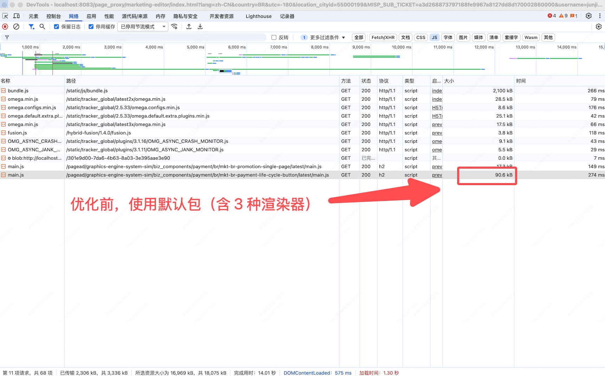

# Lottie 动画实现及性能优化

## 一、背景

设计稿提供的动图 GIF 源体积为 4.7MB，经有损压缩后为 1.5 MB，此时放大播放图片，能看的图形边缘出现锯齿，在 H5 图片加载阶段能看到明显卡顿、掉帧。

## 二、操作

1. 使用 Adobe AE 的 Bodymovin 插件导出动图文件（文件包含一份 json 文件和 image 文件夹）——设计提供
2. 将 image 文件夹中的图片经 TinyPng 压缩后，上传至 CDN 桶，并获取图片地址
3. 将 json 文件 assets 字段的属性 "p" 从本地地址改为 CDN 图片地址
4. 引入 json 文件到业务代码
5. 项目安装 lottie-web 库，版本与 json 文件中的字段"v"一致
6. 执行 lottie 实例初始化，并监听

```json
{
    "v": "5.12.2",
    "fr": 60,
    "ip": 0,
    "op": 180,
    "w": 2250,
    "h": 726,
    "nm": "动效",
    "ddd": 0,
    "assets": [
        {
            "id": "image_0",
            "w": 555,
            "h": 441,
            "u": "",
            "p": "图片的 CDN 地址",
            "e": 0
        }
    ],
    "layers": [
        {
            "ddd": 0,
            "ind": 3,
            "ty": 2,
            "nm": "xx",
            "refId": "image_0",
            "sr": 1,
            "ks": {
                "o": { "a": 0, "k": 100, "ix": 11 },
                "r": { "a": 0, "k": 0, "ix": 10 },
                "p": {
                    "a": 1,
                    "k": [],
                    "ix": 2,
                    "l": 2
                },
                "a": { "a": 0, "k": [277.5, 220.5, 0], "ix": 1, "l": 2 },
                "s": { "a": 0, "k": [100.227, 100.227, 100], "ix": 6, "l": 2 }
            },
            "ao": 0,
            "ip": 0,
            "op": 300,
            "st": 0,
            "bm": 0
        }
    ],
    "markers": [],
    "props": {}
}
```

```javascript
import { html, type TemplateResult, css } from 'lit';
import { customElement, property } from 'lit/decorators.js';
import { classMap } from 'lit/directives/class-map.js';
import lottie from 'lottie-web/build/player/lottie_svg.min.js';
import type { AnimationItem } from 'lottie-web';
import animationData from './data.json';

/**
 * 业务示例代码（以 Lit 框架为例）
 */
@customElement('demo')
export class Demo extends BaseElement {
  static override styles = css`
    .container {
      width: 100%;
      font-family: 'DiDiSans-Pro-Regular';
      box-sizing: border-box;
      position: relative;
      background-color: #ffffff;
      border-top: 0.13vw solid rgba(10, 18, 26, 0.05);
      padding: 5.33vw 5.33vw 10.93vw 5.33vw;
    }

    .demotion-img {
      position: absolute;
      bottom: 0;
      right: 0;
      width: 100%;
      z-index: 9;
    }

    .lottie-container {
      position: absolute;
      bottom: 0;
      right: 0;
      width: 100%;
      z-index: 9;
      display: flex;
    }
  `;

  constructor() {
    super();
  }

  /**
   * Lottie 动画实例
   */
  private lottieInstance: AnimationItem | null = null;

  /**
   * Lottie 是否加载失败
   */
  @property({ type: Boolean })
  private lottieLoadFailed = false;

  /**
   * 初始化 Lottie 动画
   */
  private initLottie() {
    const container = this.shadowRoot?.querySelector(
      '.lottie-container'
    ) as HTMLElement;

    if (!container) {
      console.warn('Lottie 容器未找到');
      this.lottieLoadFailed = true;
      return;
    }

    try {
      const animationConfig = {
        container,
        renderer: 'svg' as const,
        loop: true,
        autoplay: true,
        animationData: animationData,
      };

      this.lottieInstance = lottie.loadAnimation(animationConfig);

      this.lottieInstance.addEventListener('data_failed', () => {
        console.warn('Lottie 动画数据加载失败');

        this.lottieLoadFailed = true;
        this.requestUpdate();
      });

      this.lottieInstance.addEventListener('loaded_images', () => {
        console.warn('Lottie 动画数据加载成功');
      });

      // 监听图片加载失败事件
      this.lottieInstance.addEventListener('DOMLoaded', () => {
        // 检查是否有图片加载失败
        const images = container.querySelectorAll('image');
        images.forEach(img => {
          const imageElement = img as SVGImageElement;
          imageElement.addEventListener('error', () => {
            console.warn('Lottie 图片资源加载失败');
            this.lottieLoadFailed = true;
            this.requestUpdate();
          });
        });
      });
    } catch (error) {
      console.warn('Lottie 动画初始化失败');
      this.lottieLoadFailed = true;
      this.requestUpdate();
    }
  }

  /**
   * 组件首次更新后初始化 Lottie
   */
  override firstUpdated() {
    super.firstUpdated();
    this.initLottie();
  }

  /**
   * 组件断开连接时销毁 Lottie 实例
   */
  override disconnectedCallback() {
    super.disconnectedCallback();
    if (this.lottieInstance) {
      this.lottieInstance.destroy();
      this.lottieInstance = null;
    }
  }

  render(): TemplateResult {
    return html`
      <div class="container">
        ${!this.lottieLoadFailed
          ? html`<div class="lottie-container"></div>`
          : html`  `}
      </div>
    `;
  }
}

```

## 三、效果

| 方案 | 体积 | 平均耗时 | 视觉效果 | 体验 | 结论 |
| --- | --- | --- | --- | --- | --- |
| img 标签加载 gif 图 | 1.5MB（gif） | 2000ms | 加载期间卡顿，加载完成后丝滑 | 差 | 作为 Lottie 的降级方案 |
| lottie 库用 json 描述动画 | 130KB = 60KB（2 张 png）+ 70KB（npm） | 150ms | 加载完成后丝滑 | 优 | ✅ |


## 四、进阶

### 4.1 指定渲染器

明确代码需要使用的渲染器（SVG、Canvas、HTML），通常 1 个项目只用到 1 种

```javascript
// 只需要Canvas渲染器
import lottie from 'lottie-web/build/player/lottie_canvas.min.js';
// 只需要SVG渲染器（最小体积）
import lottie from 'lottie-web/build/player/lottie_svg.min.js';
// 轻量HTML渲染器
import lottie from 'lottie-web/build/player/lottie_light_html.min.js';
```

| 方案              | 源体积   | GZIPPED | 效果 |
| ----------------- | -------- | ------- | ---- |
| 默认包 gif 图     | 306.3 KB | 77 KB   | ❌   |
| 指定渲染器（SVG） | 243.2 KB | 63.1 KB | ✅   |



### 4.2 压缩 JSON

一些第三方 lottie 文件压缩工具：

-   https://lottiefiles.com/tools/lottie-json-to-optimized-lottie-json
-   https://www.lottiemizer.com/zh/
-   https://lotty.tanpok.com/

### 4.3 压缩附图

将图片体积小于 2KB 的图片，转成 Base64 格式，附在 xx.json 文件的 assert 字段的属性“p”中

```json
"assets": [{
  "id": "icon",
  "u": "",
  "p": "data:image/png;base64,iVBORw0KGgoAAAANSUhEUgAA..."
}]
```

### 4.4 动态 JSON

提前将 json 文件上传到云端，然后通过接口动态下发下载地址，客户端下载下来后再显示动画。

可以从 ① 是否动态 JSON、②JSON 体积大小、③ 业务是否强依赖、④ 兜底接口失败情况的成本等方面进行考虑。

**附注：文件不大、动图不需要根据条件变的，推荐写死在代码中。**

### 4.5 Adobe AE 配置

Bodymovin 插件设置（设计操作）

```shell
"decimalPrecision": 2, // 关键帧数值精度（默认是 6 位）
"shapeOptimization": true, // 合并相邻路径点
"keyframeReduction": true // 移除冗余关键
```

## 五、原理/使用

### 5.1 原理

```json
{
    "fr": 30, // 帧率
    "ip": 0, // 起始关键帧
    "op": 20, // 结束关键帧
    "w": 150, // 视图宽
    "h": 130, // 视图高
    "assets": [], // 资源集合
    "layers": [
        {
            // 图层
            "ty": 0, // 图层类型。
            "refId": "", // 引用的资源，图片/预合成层
            "ks": {}, // 变换。对应AE中的变换设置
            "layer": [], // 该图层包含的子图层
            "shapes": [], // 形状图层
            "w": 1334,
            "h": 750,
            "bm": 0
        }
    ], // 图层集合
    "masker": [] // 蒙层集合
}
```

一个完整动画 View 由很多个子 Layer 组成，每个子 Layer 中主要通过 shapes（形状），masks（蒙版），transform 三大部分进行动画。

通过读取 Json 文件可以获取到每个子 Layer 的 shapes，masks，以及出现时间，消失时间，Transform 各个属性的关键帧数组。

动画通过给 CompositionLayer（所有的子 layer 都添加在这个 Layer 上）的 "CurrentFrame" 属性添加一个 CABaseAnimation 来实现。

所有的子 Layer 根据 CurrentFrame 属性的变化，根据 Json 中的关键帧数组计算出自己的当前状态进行显示。


### 5.2 方法

-   **play()**：播放动画，从当前停止帧开始
-   **stop()**：终止动画，回到第 0 帧
-   **pause()**：暂停动画，停止在当前帧
-   **setLocationHref(href)**：href 作为 location.href，当在 Safari 中遇到不带符号的掩码问题时，它非常有用
-   **setSpeed(speed)**：设置动画速度（1 是正常速度）。speed 参数为速度，number
-   **goToAndStop(value, isFrame)**：动画跨越到某进度并停止。value 为进度数值，number；isFrame 定义第一个参数（value）是基于时间的值还是基于帧的（默认为 false）
-   **setDirection(direction)**：设置动画播放顺序（顺序播放/倒叙播放）。direction 参数表明顺序，1 为顺序，-1 为倒叙
-   **playSegments(segments, forceFlag)**：播放动画片段。segments 参数可以包含两个将用作动画第一帧和最后一帧的数值，或者可以包含一系列数组，每个数组都有 2 个数值，array。forceFlag 表示是否立即强制播放该片段，如果设置为 false，它将等待当前段完成。如果为 true，它将立即播放此片段，boolean。
    -   如 `animation.playSegments([10,20], false);` // 播放完之前的片段，播放 10-20 帧
    -   如 `animation.playSegments([[0,5],[10,18]], true);` // 直接播放 0-5 帧和 10-18 帧
-   **setSubframe(useSubFrames)**：useSubFrames 参数如果为 false，则将尊重原始的 AE fps。如果为 true，它将使用中间值在每个 RequestAnimationFrame 上更新。默认值为 true，boolean
-   **destory()**：删除该动画，移除相应的元素标签等。在 unmount 的时候，需要调用该方法
-   **getDuration(inFrames)**：获取动画持续时间。inFrames 参数为 true，则返回以帧为单位的持续时间；如果为 false，则返回以秒为单位的持续时间

```javascript
lottie实例.play(); // 播放该动画，从目前停止的帧开始播放
lottie实例.stop(); // 停止播放该动画，回到第0帧
lottie实例.pause(); // 暂停该动画，在当前帧停止并保持

lottie实例.goToAndStop(value, isFrame); // 跳到某个时刻/帧并停止。isFrame(默认false)指示value表示帧还是时间(毫秒)
lottie实例.goToAndPlay(value, isFrame); // 跳到某个时刻/帧并进行播放
lottie实例.goToAndStop(30, true); // 跳转到第30帧并停止
lottie实例.goToAndPlay(300); // 跳转到第300毫秒并播放

lottie实例.playSegments(arr, forceFlag); // arr可以包含两个数字或者两个数字组成的数组，forceFlag表示是否立即强制播放该片段
lottie实例.playSegments([10, 20], false); // 播放完之前的片段，播放10-20帧
lottie实例.playSegments(
    [
        [0, 5],
        [10, 18],
    ],
    true
); // 直接播放0-5帧和10-18帧

lottie实例.setSpeed(speed); // 设置播放速度，speed为1表示正常速度
lottie实例.setDirection(direction); // 设置播放方向，1表示正向播放，-1表示反向播放
lottie实例.destroy(); // 删除该动画，移除相应的元素标签等。在unmount的时候，需要调用该方法
```

### 5.3 事件

在使用中可能也需要监听一些事件：

-   **complete**：播放完成（循环播放下不会触发）
-   **loopComplete**：当前循环下播放（循环播放/非循环播放）结束时触发
-   **enterFrame**：每进入一帧就会触发，播放时每一帧都会触发一次，stop 方法也会触发
-   **segmentStart**：播放指定片段时触发，playSegments、resetSegments 等方法刚开始播放指定片段时会发出，如果 playSegments 播放多个片段，多个片段最开始都会触发
-   **data_ready**：动画数据 json 文件加载完毕触发
-   **data_fail**：动画数据 json 文件加载失败触发
-   **loaded_images**：当所有图片加载成功/失败时触发
-   **DOMLoaded**：动画相关的 dom 已经被添加到 html 后触发
-   **destroy**：将在动画删除时触发

```javascript
lottie实例.addEventListener('enterFrame', function () {
    console.log('lottie');
});
```

# 参考资料

-   [Lottie - 轻松实现复杂的动画效果](https://juejin.cn/post/6844903661760413704)
-   [Lottie：让动画真的”动”起来](https://juejin.cn/post/7329410360221728794)
-   [Lottie:让 Web 动画更简单](https://juejin.cn/post/7200388232105754680)
-   [Android Lottie 体积优化实践：从 6.4 MB 降到 530 KB](https://jishuzhan.net/article/1798189647969390593)
-   [Lottie 库的使用调研(对比 gif，序列帧，视频)](https://juejin.cn/post/7211061398678782013)
-   [airbnb lottie-web](https://github.com/airbnb/lottie-web)
