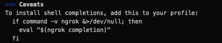
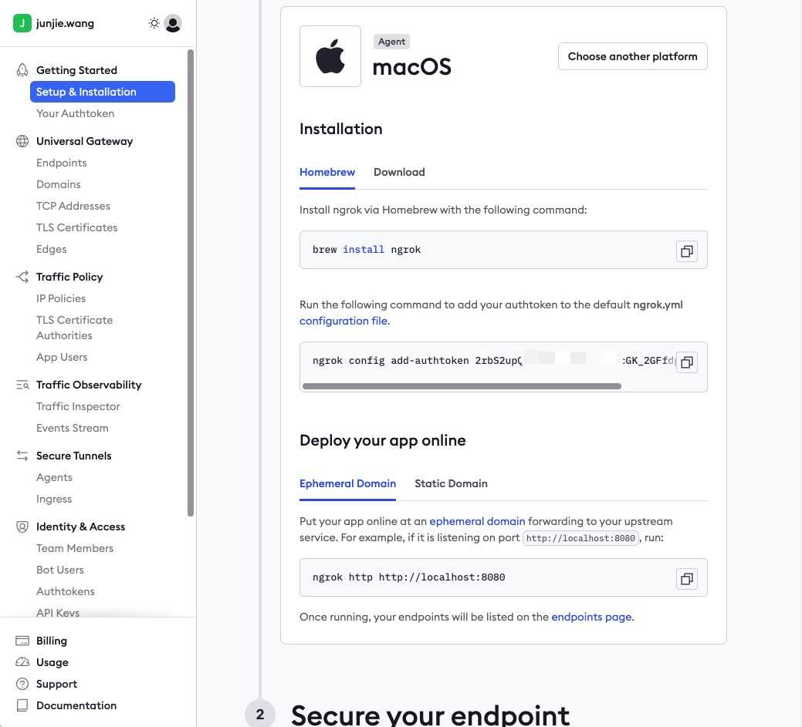
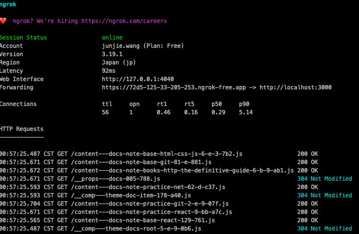

## 网络

### 内网穿透(ngrok)

1. 登录 https://dashboard.ngrok.com 完成账号注册（不支持 qq 邮箱，可以用其它替代，如 163.com）
2. 角色选择软件工程师，会弹出 ngrok 的安装教程，执行相应命令完成安装
3. 执行安装：`brew install ngrok`，若终端提示`To install shell completions, add this to your profile` ，则将下列代码添加至 `~/zshrc` 文件中

```bash
if command -v ngrok &>/dev/null; then
    eval "$(ngrok completion)"
fi
```

4. 配置身份 token: `ngrok config add-authtoken <your_token>`
5. 配置需要穿透的本地或內网 ip 地址（同时支持 `http/https`），例如 `ngrok http http:/localhost:8080`  
   
6. 穿透成功，可以访问[web Interface](http://127.0.0.1:4040)可视化查看公网访问记录  
   
