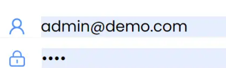

# H5 移动端

## 常见问题【HTML】

### 调用系统功能

```html
<!-- 拨打电话 -->
<a href="tel:10010">拨打电话给10010</a>
<!-- 发送短信 -->
<a href="sms:10010">发送短信给10010</a>
<!-- 发送邮件 -->
<a href="mailto:randy@qq.com">发送邮件给randy</a>
<!-- 选择照片或拍摄照片 -->
<input type="file" accept="image/*" />
<!-- 选择视频或拍摄视频 -->
<input type="file" accept="video/*" />
<!-- 选择文件 -->
<input type="file" />
<!-- 多选文件 -->
<input type="file" multiple />
```

### 忽略自动识别

```html
<!-- 忽略自动识别电话 -->
<meta name="format-detection" content="telephone=no" />
<!-- 忽略自动识别邮箱 -->
<meta name="format-detection" content="email=no" />
<!-- 忽略自动识别电话和邮箱 -->
<meta name="format-detection" content="telephone=no, email=no" />
```

### 弹出数字键盘

```html
<!-- 纯数字带#和* -->
<input type="tel" />
<!-- 纯数字 -->
<input type="number" pattern="\d*" />
```

### 优先使用最新版本 IE 和 Chrome

```html
<meta http-equiv="X-UA-Compatible" content="IE=edge,chrome=1" />
```

### 禁止页面缓存

```html
<meta http-equiv="Cache-Control" content="no-cache" />
```

### 关闭首字母大写

```html title="使用键盘在输入框输入英文字符时，一般首字母会自动大写，如果不需要可以关闭"
<input type="text" autocapitalize="off" />
```

### 关闭输入自动修正

```html title="IOS 默认输入法会开启自动修正输入内容，这样的话，用户经常要操作两次"
<input type="text" autocorrect="off" />
```

### 禁止页面缩放

```html title="把viewport的user-scalable值设置为no"
<meta
    name="viewport"
    content="width=device-width, user-scalable=no, initial-scale=1, minimum-scale=1, maximum-scale=1"
/>
```

### 长按识别二维码

长按二维码自动识别出二维码，把图片用 img 标签展示就可以了,不要使用背景图，不然会无效

## 常见问题【CSS】

### 安全距离设置

```css title="例如 iphone X 底部有安全距离区，以内边距为例的样式配置"
.content {
    padding-bottom: 16px;
    padding-bottom: env(safe-area-inset-bottom); /* 兼容 IOS < 11.2 */
    padding-bottom: constant(safe-area-inset-bottom); /* 兼容 IOS > 11.2 */
}
```

### 1px 问题

1px 问题在 Retina 高清屏上才会出现，由于高清屏用多个物理像素显示一个 css 像素，比如 iphone6，由于 dpr 为 2，所以 1css 像素会用 2 个物理像素显示，所以看起来 1px 的线条会特别宽。解决 1px 问题的方案有很多，有背景图、阴影、缩放等等，笔者在这里只介绍笔者曾经使用过得方案，就是缩放。原理就是边框固定，把元素整体先放大然后再缩小

```css title="这里只介绍缩放，原理就是边框固定，把元素整体先放大然后再缩小"
.ele {
    position: relative;
    width: 100px;
    height: 80px;
    &::after {
        content: '';
        position: absolute;
        left: 0;
        top: 0;
        border: 1px solid red;
        width: 200%;
        height: 200%;
        transform: scale(0.5);
        transform-origin: left top;
    }
}
```

如果不想给每个元素都这样设置的话，可以采用 lib-flexible 方案，根据 dpr 将网页整体进行缩放

### 横屏和竖屏

```css title="在某些特定横屏或者竖屏的情况下的样式我们可以通过如下@media查询进行设置"
/* 竖屏 */
@media all and (orientation: portrait) {
    /* 自定义样式 */
}
/* 横屏 */
@media all and (orientation: landscape) {
    /* 自定义样式 */
}
```

### 苹果手机滚动更流畅

```css title="在苹果手机上滚动的时候有时候可能会不流畅，我们可以给元素添加如下属性"
.elem {
    -webkit-overflow-scrolling: touch;
}
```

### 苹果手机字体变清晰

```css
.elem {
  -webkit-font-smoothing：antialiased;
}
```

### 图片禁止选择

```css title="有时候我们的图片不想让别人长按保存等操作，我们可以使用如下样式，让用户长按图片无效"
#img1 {
    pointer-events: none; /* 微信浏览器还需附加该属性才有效 */
    user-select: none;
    -webkit-user-select: none;
    -webkit-touch-callout: none;
}
```

### 原生表单美化

```css title="使用原生表单的时候样式会很丑，特别还有一层灰色的遮罩，可以使用如下样式把遮罩进行消除"
button,
input,
select,
textarea {
    -webkit-appearance: none;
}
```

### 元素被点击时产生的半透明灰色遮罩去掉

```css title="使用原生表单的时候，点击的时候会有个灰色点击特效，可以使用如下样式消除"
a,
button,
input,
textarea,
select {
    -webkit-tap-highlight-color: transparent;
}
```

### 美化滚动条

```css title="滚动条样式太丑希望自定义，可以使用如下样式属性进行自定义样式，PC和移动端均适用"
/* 滚动条整体部分 */
::-webkit-scrollbar {
    width: 6px;
    height: 6px;
    background-color: transparent;
}
/* 滚动条轨道部分 */
::-webkit-scrollbar-track {
    background-color: transparent;
}
/* 滚动条滑块部分 */
::-webkit-scrollbar-thumb {
    border-radius: 3px;
    background-image: linear-gradient(90deg, #09f, #3c9);
}
```

### 隐藏滚动条

```css
::-webkit-scrollbar {
    display: none; /* Chrome Safari */
}
```

### 美化占位符 placeholder

```css
input::placeholder {
    color: red;
}
```

### input 文字居中对齐

```css title="有时候设置了line-height的值等于height，文字看起来也不居中，可以使用如下样式"
input {
    line-height: normal;
}
```

### 修改 input 光标颜色

```css
/* 不会影响字体颜色，只会修改光标颜色 */
input {
    caret-color: red;
}
/* 字体颜色和光标颜色一起修改 */
input {
    color: red;
}
```

### input 自动填充时出现背景颜色去除

比如，如果保存了账号密码，自动填充会有一个背景颜色  
解决就是给它设置一个足够大的白色内阴影

```css
:-webkit-autofill {
    box-shadow: 0 0 0px 1000px white inset !important;
}
```

这样设置后背景色会没有，但是自动填充的内容文本默认是黑色的  如果也想让字体颜色自定义的话还需要加上如下样式,比如蓝色

```css
:-webkit-autofill {
    :-webkit-autofill {
        -webkit-text-fill-color: #4c7fd2 !important;
    }
}
```


